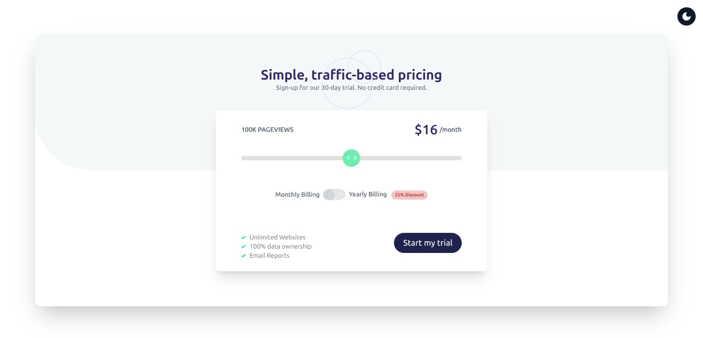
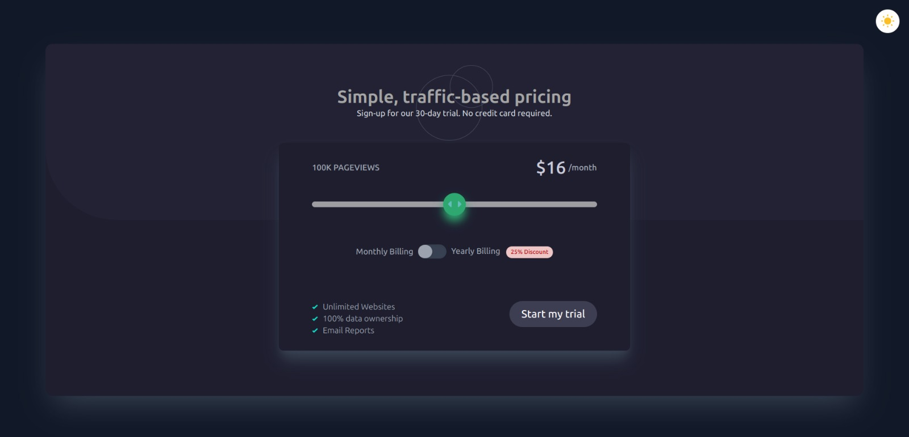

# Pricing Component with Theme Toggle

### Main UI Features:

1. **Theme Toggle Button**
   - Adjusts background and text colors throughout the page according to the selected theme.

   - Positioned in the top-right corner of the screen.
   - Switches the UI between **light** and **dark** modes.

This project is a **Next.js** app utilizing **TypeScript** and **Tailwind CSS**. It features a dynamic pricing component with a theme toggle.

2. **Pricing Component**:
   - Displays a card with pricing details.
   - Includes a toggle switch to alternate between different billing plans (monthly/yearly).
   - The UI adapts responsively, providing a clean layout for various screen sizes. 

The images above show the component in both light and dark modes.